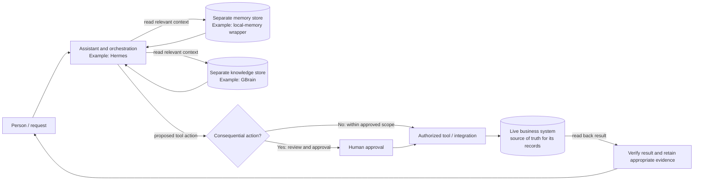

# Reference architecture

This page adds a system-level view to the [plain-language Start Here guide](start-here.md). It describes roles, boundaries, and a representative flow—not a ready-to-install system. The local-memory wrapper named in the reference is private and is not distributed here; Mem0 is an open-source foundation only, not a drop-in replacement.

## Plain-language view

A person makes a request. An assistant coordinates the work and may read relevant context from separate memory and knowledge stores. It can then propose or prepare a tool action. For consequential changes, a person reviews and approves the action before it reaches the live business system. The result is read back and checked; evidence of the outcome should be kept where the business record belongs.

The stores help provide context. They are **not** the source of truth for live business records such as a current appointment, payment, or customer record. Verify those in the authoritative business system. The boxes below show conceptual roles, not a proven integration or deployment topology.

This diagram is a conceptual reference. It does not assert that these named projects are integrated, that a workflow has been exercised end to end, or that every action should use the same approval rule. Define approval, exception handling, and verification for the actual task and risk.

## Developer reference

Evidence labels describe only the basis for including each example; they are not performance or security ratings.

| Role | Reference example and upstream source | Evidence label | Boundary |
|---|---|---|---|
| Assistant/runtime and orchestration | [Hermes Agent](https://github.com/NousResearch/hermes-agent) ([official docs](https://hermes-agent.nousresearch.com/docs/)) | Upstream project and documentation reviewed; role example only | Hermes is one possible agent/runtime. This guide does not claim it is connected to either store or any business system. |
| Durable structured knowledge/context | [GBrain](https://github.com/garrytan/gbrain) | Upstream project reviewed; current local MCP connection and tool discovery checked 2026-09-27 | Example role only. Deployment topology and configuration are private and intentionally omitted. A connection/tool-discovery check does not establish installation, independent deployability, or end-to-end interoperability. |
| Persistent memory/context | [Mem0 open source](https://github.com/mem0ai/mem0) ([Python quickstart](https://docs.mem0.ai/open-source/python-quickstart)) | Open-source foundation identified; current local wrapper MCP connection and tool discovery checked 2026-09-27 | The exact local-memory wrapper used in the example is **not publicly available**. Developers must assemble a connector/wrapper; Mem0 alone is not that plug-and-play component. The check does not establish installation, independent deployability, or end-to-end interoperability. |
| Tool/data connection protocol | [Model Context Protocol (MCP)](https://modelcontextprotocol.io/introduction) | Official protocol introduction reviewed | MCP is a protocol for connecting AI applications with tools and data; it does **not** grant authorization by itself. Grant least privilege and inspect what each tool can read or write. |
| Live business records and actions | The relevant business application or service selected by the operator | Architectural role; no specific integration tested by this guide | Keep the authoritative live record in its owning system. Read back consequential changes and verify there. |

**Provider-neutral alternatives:** choose components by role, not by brand. An assistant/runtime, one or more context stores, an access-controlled connector layer, and the business system that owns each live record can come from different providers or be operated directly by the business. Assess their actual permissions, retention, and data handling before connecting them; this guide does not validate any substitute.

## Trust, privacy, and verification boundaries

- Separate context stores from live operational records. Memory or retrieved knowledge can be stale, incomplete, or unsuitable as proof that a business action happened.
- Treat tool access as a security boundary. MCP does not confer permission; use least privilege, limit read/write access, and review each tool's capabilities before enabling it.
- “Local storage” does **not** guarantee model processing is local. Depending on deployment, sensitive content used as context may be sent to the selected model/provider. Establish what data leaves the environment, where it is processed, and what is retained before use.
- Require human review for consequential actions according to the workflow's risk. Read back the target system's state and preserve only appropriate evidence; a tool response or diagram is not proof of a completed business outcome.
- The local MCP checks noted above establish connection and tool discovery only on 2026-09-27. Installation, independent deployment of the wrapper, end-to-end workflows, and interoperability are **not tested by this public guide**. No setup commands or credentials are provided here.

*Sources and local connection-check status last checked: 2026-09-27.*
